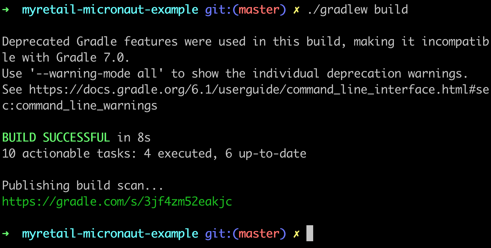

# myretail-micronaut-example 

The myRetail Micronaut Example application is a simple microservice that aggregates product data from multiple data sources and provides an endpoint for GET requests at: `/products/{id}`.

---

This project is built using gradle. The following are standard commands for Gradle. On windows, use `gradlew` instead of `./gradlew`

## Running checks locally

To ensure that all checks are passing, execute:

`./gradlew check` 

This command will run the tests and any other checks like any code coverage and static analysis tools.

## Building the app

To run a full build including compilation, any checks (tests, static analysis, code coverage, etc), and creation of a jar, execute the command:

`./gradlew build`

## Running the app

To run the app, execute the command

`./gradlew run`

## Debugging build issues

Included in the build config is a plugin that generates a report called a build scan which is useful for debugging build issues including compilation errors, dependency conflicts, and more. The url for that report is at the end of the build output.

## Requirements
* Java 9-12
* a local instance of Redis (default settings)

## Good to Know

There is Swagger UI documentation at `/swagger-ui` and it includes a try it button.

Redis must be running (`redis-server`) before you start the application. It is not necessary for the tests.

The ids I know are valid (as of the morning of May 14) are: 54456119, 13264003, 12954218.
